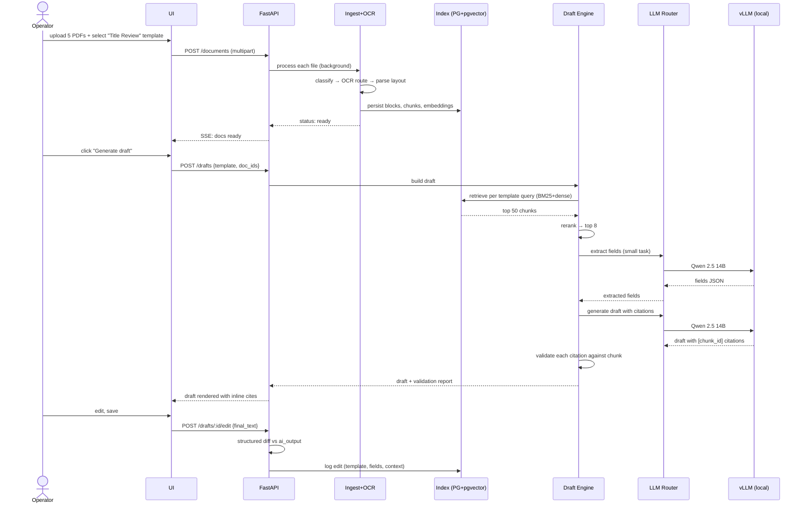
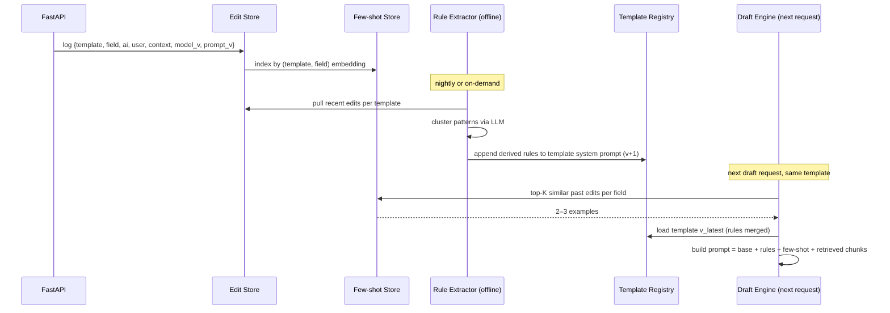

# Architecture

## High-level component diagram

```mermaid
flowchart TB
    UI[Next.js Operator UI]
    API[FastAPI Service]

    subgraph Ingest [Ingest & Understand]
        CLS[Document Classifier<br/>native / scanned / handwritten]
        OCR[OCR Pipeline<br/>pdfplumber → PaddleOCR → VLM]
        PARSE[Layout Parser<br/>docling]
    end

    subgraph Retrieval
        CHUNK[Semantic Chunker]
        EMB[Embedder<br/>bge-large-en-v1.5]
        IDX[(Postgres + pgvector<br/>BM25 FTS + dense)]
        RET[Hybrid Retriever<br/>RRF fusion]
        RR[Reranker<br/>bge-reranker-base]
    end

    subgraph Draft [Draft Engine]
        TEMPL[Template Registry]
        EXTR[Field Extractor]
        GEN[Generator]
        VAL[Citation Validator]
    end

    subgraph EditLoop [Edit Loop]
        EDIT[Edit Capture]
        DIFF[Structured Diff]
        FS[Few-shot Store]
        RULE[Rule Extractor<br/>offline]
    end

    ROUTER[LLM Router<br/>vLLM local | Anthropic | OpenAI | Gemini]

    UI -->|upload| API
    UI -->|edit| API
    API --> CLS --> OCR --> PARSE --> CHUNK --> EMB --> IDX
    API -->|draft request| TEMPL
    TEMPL --> RET --> RR --> EXTR --> GEN --> VAL
    RET <--> IDX
    EXTR --> ROUTER
    GEN --> ROUTER
    RULE --> ROUTER
    VAL --> ROUTER
    API -->|user edit| EDIT --> DIFF
    DIFF --> FS
    DIFF --> RULE
    FS -->|few-shot examples| GEN
    RULE -->|prompt steering| TEMPL
```

## Component list

| # | Component | One-line responsibility | File |
|---|---|---|---|
| 1 | **Ingestion + OCR Pipeline** | Accept upload, classify, OCR, parse layout, persist blocks with coordinates. | `03-components/ingestion-ocr.md` |
| 2 | **Retrieval Layer** | Chunk, dual-index, hybrid retrieve, rerank. | `03-components/retrieval.md` |
| 3 | **Draft Engine** | Template-driven extraction + generation + validation. | `03-components/draft-engine.md` |
| 4 | **LLM Router** | Single interface across local vLLM and hosted providers, with task-tier routing. | `03-components/llm-router.md` |
| 5 | **Edit Loop** | Capture edits, extract reusable signal, feed back via few-shot and rule extraction. | `03-components/edit-loop.md` |
| 6 | **API + UI** | FastAPI HTTP surface + minimal Next.js operator UI. | `03-components/api-ui.md` |

## Data flow — happy path



## Data flow — edit feedback loop



## Deployment shape

A single Docker Compose stack for local development and demo:

- `api` — FastAPI service (uvicorn workers)
- `worker` — same image, runs background ingestion (started but not strictly separated from `api` in v1; same code path, separate process for cleanliness)
- `vllm` — vLLM serving Qwen 2.5 14B Instruct (optional; absent on machines without GPU, in which case router falls back to hosted)
- `postgres` — Postgres 16 with `pgvector` and `pg_trgm` extensions
- `ui` — Next.js dev server (or static build)

No Redis, no Celery, no queue broker in v1. Background tasks live in `api`'s process via `BackgroundTasks` + a simple in-memory job table backed by Postgres for state. This is honest for the demo throughput target and avoids 4 services that wouldn't earn their place.

## What is deliberately one component, not two

- **API and worker** share a code base and database. Splitting them now is premature; the seam is `app.workers.*` modules invoked either inline (dev) or in a separate process (deploy).
- **Retrieval and chunker** share a module — the chunker exists only to feed the index; coupling them is fine until chunking strategies fork by document type.
- **Embedder and reranker** are two models but one `ai.models` module, both pluggable via the same provider interface as the LLM router.

## What is deliberately two, not one

- **Field extractor and generator** are separate steps in the Draft Engine. Extraction is structured + cheap (small model, JSON schema); generation is open-ended + expensive. Separating them lets the generator focus on prose with the extracted fields already nailed down, and lets the validator check fields against source independently of the prose.
- **Few-shot store and rule extractor** are two different reuse mechanisms with different time horizons (immediate vs aggregated). Fusing them would hide the distinction the rubric is testing for.
