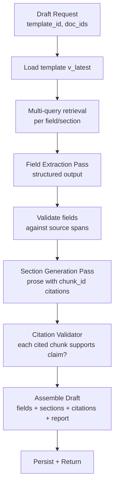

# Draft Engine

**Purpose:** Without this, retrieved chunks are just search results. The Draft Engine is where the system stops being a search tool and starts being a drafting tool — it turns retrieved evidence into a structured, cited draft following a template's contract.

**Inputs:** `template_id`, list of `document_ids`, optional `user_prefs`.
**Outputs:** A `Draft` record: structured extracted fields + free-form sections, each with chunk-ID citations, validated against source, with a confidence/groundedness report.
**Owns:** Canonical `Draft` records, `Citation` records, `DraftTemplate` registry.
**Depends on:** Retrieval Layer, LLM Router, Edit Loop (read path — pulls relevant few-shots).
**Failure mode:** If the LLM returns malformed output twice, surface a partial draft (whatever fields validated) plus an error. If retrieval returns nothing, refuse with a clear "no evidence found in supplied documents" message rather than fabricate.

---

## The template abstraction

A `DraftTemplate` is the contract between an operator's intent and the system's behavior. Adding a new draft type (notice summary, doc checklist, first-pass memo) is a new template file, not new code.

```python
@dataclass
class DraftTemplate:
    id: str                                          # "case_fact_summary"
    version: int                                     # bumped when prompts/schema change
    display_name: str
    description: str

    extraction_schema: dict[str, FieldSpec]          # structured fields
    sections: list[SectionSpec]                      # prose sections
    retrieval_queries: dict[str, str]                # field/section -> query

    system_prompt: str                               # base
    appended_rules: list[str]                        # learned from edits (see edit-loop.md)
    few_shot_examples: list[FewShotExample]          # injected at runtime from edit store

    validators: list[ValidatorSpec]                  # per-field, per-section


@dataclass
class FieldSpec:
    name: str
    type: Literal["string", "date", "money", "list[string]", "list[party]"]
    required: bool
    description: str                                  # used in extraction prompt
    must_cite: bool = True


@dataclass
class SectionSpec:
    name: str                                         # "Procedural History"
    description: str
    target_length: tuple[int, int]                    # (min, max) words
    must_cite: bool = True
```

### Templates shipped in v1

| Template | Status | Notes |
|---|---|---|
| `case_fact_summary` | Full | Most common; exercises every part of the pipeline |
| `title_review_summary` | Full | Different — table-heavy, party + property + encumbrance extraction |
| `document_checklist` | **Stub** | Proves extensibility — 1-screen YAML config, validators that check "is this doc type X present in the corpus" |

Two production-grade templates + one stub demonstrates the abstraction without burning the build window.

---

## Generation pipeline



### Pass 1 — Field extraction

For each field in the template:
1. Retrieve top chunks via the field's query.
2. Call LLM Router (`task=extraction`) with the chunks + a JSON schema constructed from `FieldSpec`. Request structured output (function calling / JSON mode).
3. The response contains: `{value, supporting_chunk_ids[], confidence}`.
4. Validate: do the supporting chunks actually contain the value? (Substring check for hard values; semantic check via a small classifier or LLM for soft values.)

Field extraction uses the smaller / faster tier of the router. On vLLM that's Qwen 2.5 14B in JSON mode; on hosted that's `claude-haiku-4-5` or `gpt-4.1-mini`. Cheap, fast, structured.

### Pass 2 — Section generation

For each section in the template:
1. Retrieve top chunks via the section's query.
2. Bundle the extracted fields (Pass 1 output) + retrieved chunks + relevant few-shot examples + the section spec + system prompt + appended rules.
3. Call LLM Router (`task=generation`) with explicit citation instructions: "After every factual claim, cite by `[chunk:CHUNK_ID]`. Do not state facts without citations. If evidence is missing, say so."
4. Response is text with embedded chunk-ID citations.

Section generation uses the higher-quality tier — Qwen 2.5 32B on local if available, Claude Sonnet on hosted.

### Pass 3 — Citation validation

This is what separates "grounded RAG" from "RAG that talks confidently". For each cited chunk in each section:

```python
def validate_citation(claim_text: str, chunk: Chunk) -> ValidationResult:
    # 1. Trivial check: chunk_id exists
    # 2. Substring check: does the chunk contain any of the high-signal terms from the claim?
    # 3. Semantic check: prompt the LLM Router (task=validation, cheapest tier) with
    #    "Given the SOURCE: '{chunk.text}', does it SUPPORT the CLAIM: '{claim_text}'?
    #     Reply 'supported' | 'partial' | 'unsupported' | 'contradicted', no other text."
    # 4. Returns: status + reason
```

Results:
- `supported` → citation passes, rendered normally
- `partial` → rendered with a yellow underline; tooltip explains
- `unsupported` → claim flagged in the UI with a red marker; offered for regeneration or manual edit
- `contradicted` → blocking; the section is regenerated once with stronger instruction to use evidence, then surfaced to the operator if it fails again

Validation passes are batched: one LLM call per ~10 claims. Total validation cost is ~$0.01–0.05 per draft on the hosted path, near-zero local.

---

## Few-shot injection from the edit store

Before generating a section, the engine pulls 2–3 historical edits whose context most resembles the current request (matched on template + field + section + document-type tags). See `edit-loop.md` for how few-shot store is built. The examples are embedded in the prompt as:

```
Past edit example for "Procedural History" section:
  AI draft was: "..."
  Operator changed it to: "..."
  (Notice the operator prefers ... and avoids ...)
```

This is the first half of the "improvement from edits" loop. Cost: zero training, immediate effect, surprisingly strong.

---

## Tech stack

- **Language:** Python 3.11
- **Structured-output enforcement:** `pydantic` schemas → JSON schema in LLM calls; vLLM and the hosted SDKs all support guided JSON
- **Templates:** Plain Python classes (dataclasses) + YAML config files in `app/templates/*.yaml` — simplest possible thing that works; can be promoted to a DB-backed registry in v1.5
- **Validation:** A small `Validator` class hierarchy in `app/draft/validators.py`

---

## Edge cases

| Case | Strategy |
|---|---|
| Extracted field has no supporting chunk | Mark `confidence=0`, return `null`, template treats as `unsupported_field` |
| LLM returns malformed JSON in extraction | Retry once with a stricter "JSON only" reminder; if still fails, that field is `null` with `error_code=schema_violation` |
| LLM cites a `chunk_id` that doesn't exist | Strip the citation, flag the claim as unsupported, surface in UI |
| Section exceeds `target_length` max by > 50% | Truncate at last complete sentence within max; log overrun for prompt tuning |
| No chunks for a section's query | Section is rendered with explicit "Insufficient evidence in provided documents." rather than fabricated content |
| Template version changes mid-draft | Drafts in flight pinned to their starting version; new requests use latest |
| Two operators draft the same doc bundle simultaneously | Each gets their own draft record; few-shot store is per-tenant (single tenant in v1), so they share signal |
| Local vLLM crashes mid-generation | Router transparently retries on hosted; logged as a degraded run |

## Interface

```python
class DraftEngine:
    async def generate(
        self,
        template_id: str,
        document_ids: list[UUID],
        prefs: dict | None = None,
    ) -> Draft: ...

    async def regenerate_section(
        self,
        draft_id: UUID,
        section_name: str,
    ) -> Section: ...

    def list_templates(self) -> list[DraftTemplateInfo]: ...
```

## Performance

| Operation | Latency target (p95) | Cost target (hosted path) |
|---|---|---|
| Full draft, 5 fields + 4 sections | < 30s | < $0.50 |
| Section regenerate | < 8s | < $0.10 |
| Citation validation per draft | < 5s | < $0.05 |

Local vLLM path is faster on cold-start and ~free at marginal cost; latency depends on hardware.

## Open questions

- Should we cache generated drafts keyed by `(template_v, doc_id_set_hash, model_v, prompt_v)`? Same input → same output. Useful for demos and eval reruns. v1: yes, simple Postgres-backed cache.
- Streaming the section text to the UI as it's generated? Nicer UX but doubles the integration work. v1: render after completion; v1.1: stream.
- Multi-step reasoning for complex sections (e.g., "Procedural History" needs to chronologically order events from multiple documents) — current single-shot generation may underperform. v1.1: add a planner-then-writer two-step for designated sections.
