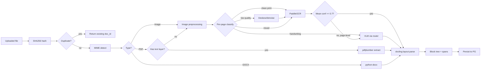

# Ingestion + OCR Pipeline

**Purpose:** Without this, the system has nothing to ground on. It turns arbitrary user files into a clean, coordinate-preserving block tree the rest of the pipeline can trust.

**Inputs:** Uploaded files via HTTP multipart. PDF, PNG, JPG, TIFF, DOCX. Up to 200 pages per file. Up to 50MB per file (configurable).

**Outputs:** For each document, a persisted record containing: SHA256 hash, original filename, page count, document-type classification, full extracted text (concatenated by reading order), and a block tree (sections → paragraphs / tables / figures / lists) with every span carrying `(page, x0, y0, x1, y1, confidence)`.

**Owns:** Canonical `Document`, `Page`, `Block`, `Span` records.

**Depends on:** Postgres for persistence; vLLM (via LLM Router) optionally for VLM fallback on the hardest pages; PaddleOCR weights cached locally; `docling` for layout parsing.

**Failure mode:** If OCR fails on a page, that page's `Block`s are marked `status=ocr_failed` and excluded from chunking, but the document as a whole is still usable. If a whole document fails (e.g. corrupt PDF), the upload returns a typed error and is not retried automatically — the operator gets to retry or contact support.

---

## Tech stack

- **Language / runtime:** Python 3.11
- **Format detection:** `python-magic` for MIME, `pypdf` to check for a text layer
- **Native PDF extraction:** `pdfplumber` (lighter, exposes coordinates cleanly; alternative `PyMuPDF` if `pdfplumber` chokes on complex PDFs)
- **OCR engines:**
  - `PaddleOCR` (primary) — strong general OCR, multi-language, exposes word-level confidences
  - `Tesseract` (via `pytesseract`) — fallback if PaddleOCR fails to install on a given machine; lower quality, still works
  - **VLM via LLM Router** — escalation only, when classical OCR mean confidence < 0.7 or the page is classified as handwriting-heavy
- **Layout parsing:** `docling` (IBM) — modern, table-aware, outputs structured Markdown + block metadata. Falls back to `unstructured` if `docling` fails on a given file type.
- **Image preprocessing:** `opencv-python` (deskew, denoise, binarize) and `Pillow`
- **DOCX:** `python-docx` (rare path; legal docs are mostly PDFs in practice)

### Why this stack, not "throw everything at a VLM"

| Path | Cost per page | Latency | Use when |
|---|---|---|---|
| `pdfplumber` direct text | $0, ~10ms | Instant | Native PDF, text layer present |
| PaddleOCR | $0, ~500ms (CPU), ~80ms (GPU) | Fast | Clean scan, printed text |
| PaddleOCR with preprocessing | $0, ~700ms | Fast | Rotated, low-contrast, noisy scan |
| VLM (Claude/GPT-4o vision via router) | ~$0.01–0.03 | 3–8s | Handwriting, novel layout, last resort |

A 100-page document of native PDFs costs $0 and ~5s. The same 100 pages via a VLM is $1–3 and 5–10 minutes. The routing is the design.

---

## Pipeline detail



## Document-type classifier (per-page)

A small heuristic, not a model:

```python
def classify_page(page_image) -> PageType:
    # 1. Has text layer in PDF? -> NATIVE
    # 2. Otherwise, run a fast pre-OCR scan:
    #    - mean Laplacian variance < threshold -> BLURRY (preprocess hard)
    #    - dominant stroke direction analysis -> HANDWRITING_LIKELY
    #    - aspect-ratio + line-density heuristic -> FORM_LAYOUT
    # 3. Default: CLEAN_SCAN
```

When this heuristic is unsure, default to PaddleOCR with preprocessing — cheapest reasonable path. Escalate only if PaddleOCR's output is low-confidence.

## Coordinate preservation

Every span the pipeline produces carries:

```python
@dataclass
class Span:
    text: str
    page: int
    bbox: tuple[float, float, float, float]  # (x0, y0, x1, y1) normalized 0-1
    confidence: float
    source: Literal["pdfplumber", "paddleocr", "vlm", "docling"]
```

Coordinates are critical: the UI's "highlight source span on citation hover" feature depends on them, and a future human-review UI for low-confidence fields also needs them. Without coordinates, downstream features need redo work.

## Block tree

```python
@dataclass
class Block:
    id: str
    document_id: str
    parent_block_id: str | None
    type: Literal["section", "paragraph", "table", "figure", "list", "header", "footer"]
    page_range: tuple[int, int]
    bbox: tuple[float, float, float, float] | None
    text: str
    metadata: dict  # type-specific: table cells, list items, caption text
    reading_order: int
```

Tables are stored with cell-level structure (`metadata["cells"]` is a 2D array), not flattened. The chunker can decide to chunk a table as a whole, by row, or by row-group.

## Implementation notes

- **Ingestion is idempotent on SHA256.** Re-uploading the same bytes returns the same `document_id`. The hash is the natural deduplication key.
- **Per-page work is parallelized** within a single document (small thread pool, 4 workers). OCR is CPU- or GPU-bound, not concurrency-bound on the I/O.
- **VLM fallback is rate-limited globally** (semaphore of 4 concurrent calls) to avoid blowing the hosted budget on a bad batch.
- **No streaming during ingestion.** The whole document must be processed before retrieval is useful. Operator polls or subscribes to SSE for status.
- **Docling output is post-processed** to drop empty blocks, merge orphan single-line paragraphs into the previous block, and normalize header capitalization.

## Edge cases

| Case | Strategy |
|---|---|
| Encrypted/password-protected PDF | Reject with typed error `PDF_ENCRYPTED`; UI prompts for password (out of scope to actually decrypt in v1, but error path is clean) |
| Image-only PDF (no text layer, looks native) | `has_text_layer` check is strict (>50 chars per page on average); otherwise treat as scan |
| Multi-column layout | `docling` handles this; if it fails, retry with `unstructured` |
| Mixed languages on one page | PaddleOCR is multi-lingual; we configure English + numeric by default and add languages on demand |
| Page sideways / upside down | Deskew pass via OpenCV; if confidence still low, rotate 90/180/270 and pick best |
| 200+ page document | Allowed; processed page-by-page with progress tracking. > 500 pages rejected (configurable) |
| Identical file uploaded twice | Returns same `document_id` (idempotent on hash) |
| Corrupt PDF / unreadable header | Typed error `FILE_UNREADABLE`, page-count = 0, status = `failed` |
| Handwriting unrecognizable even by VLM | Block stored with `text=""`, `status=unreadable`, `confidence=0.0` — flagged in UI |

## Interface

```python
# app/ingest/service.py
class IngestService:
    async def ingest(self, file: UploadFile) -> Document: ...
    async def status(self, document_id: UUID) -> IngestStatus: ...
    async def get_blocks(self, document_id: UUID) -> list[Block]: ...
```

HTTP surface (see `api-ui.md` for the full API):
```
POST /api/documents               multipart upload -> {document_id, status}
GET  /api/documents/:id           -> Document with status, page_count, type
GET  /api/documents/:id/blocks    -> Block tree
GET  /api/documents/:id/pages/:n  -> page image (for citation highlighting in UI)
```

## Open questions

- Should we run a second pass on low-confidence pages automatically (cost), or batch them into a "needs review" queue? — v1: automatic single retry with preprocessing, then flag.
- Tables in scanned forms — `docling` is good but not perfect. If the eval set shows < 80% table cell accuracy, swap to `TableTransformer` for the table-specific extraction step.
