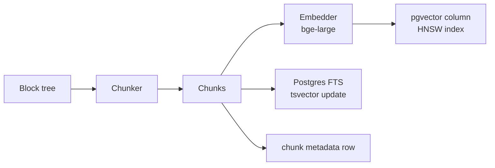

# Retrieval Layer

**Purpose:** Without this, generation hallucinates. Retrieval is what makes drafting *grounded* — every claim in the output traces back to a chunk this layer surfaced.

**Inputs:** Block tree from Ingestion (write path); template-defined queries with optional doc-id filter (read path).
**Outputs:** Ranked, deduplicated, reranked `Chunk` list with metadata sufficient for citation rendering.
**Owns:** Canonical `Chunk` records, embeddings, BM25 index state.
**Depends on:** Postgres + pgvector + pg_trgm; embedding model and reranker (both via the `ai.models` interface).
**Failure mode:** If the dense index is down or stale, BM25 alone is still usable (degraded mode). If the reranker is unavailable, return the hybrid-fused top-K without reranking. If both indexes are empty for a doc, generation should refuse and surface an empty-corpus error rather than fabricate.

---

## Tech stack

- **Chunker:** custom Python on top of the block tree (see "Chunking" below)
- **Embedder:** `bge-large-en-v1.5` (1024-d) via `sentence-transformers`, self-hosted on CPU or GPU
  - *Alternative:* OpenAI `text-embedding-3-small` (1536-d) via the embedder provider interface — pluggable
- **Vector store:** Postgres 16 + `pgvector` (HNSW index)
- **Keyword index:** Postgres FTS (`tsvector` with English config + `pg_trgm` for fuzzy match)
- **Reranker:** `bge-reranker-base` cross-encoder, self-hosted on CPU
  - *Alternative:* Cohere Rerank v3 via provider interface

### Why this stack

| Choice | Alternative considered | Why this wins for v1 |
|---|---|---|
| Postgres + pgvector | Qdrant, Weaviate, Pinecone | Already need Postgres for documents/edits/drafts. Under 5M chunks, pgvector is fast. Transactional inserts across chunks + embeddings + blocks. Revisit at 5M+ chunks or if HNSW recall becomes the bottleneck. |
| `bge-large-en-v1.5` | OpenAI `text-embedding-3-small` | Free, strong on legal/long-form, runs on CPU. Pluggable — config swap to OpenAI takes one env var. |
| `bge-reranker-base` (not -large) | -large variant, Cohere | -base is good enough for top-50 → top-8 reranking and runs CPU-only in ~200ms. -large gates GPU and the marginal precision isn't worth it at MVP scale. |
| Hybrid BM25+dense | Pure dense | Legal docs have rare terms (party names, statute citations, dates) that dense embeddings smooth over and BM25 nails. Hybrid + RRF is a tiny code addition and a real recall win. |

---

## Chunking

A semantic chunker driven by the block tree, not a token sliding window.

```python
def chunk_document(doc: Document, blocks: list[Block]) -> list[Chunk]:
    """
    Strategy:
    - Headers and section boundaries are hard splits.
    - Paragraphs become individual chunks (typically 100-500 tokens).
    - Long paragraphs (>800 tokens) get split at sentence boundaries with 50-token overlap.
    - Tables: each table is one chunk; if >800 tokens, split by row group; cell coordinates retained.
    - Lists: small lists (<10 items) stay together; longer lists split into windows of ~10 items.
    - Each chunk inherits the section hierarchy as metadata for "where in doc" context.
    """
```

Each `Chunk` carries:

```python
@dataclass
class Chunk:
    id: str                      # uuid7, sortable
    document_id: str
    block_ids: list[str]         # source blocks
    text: str
    char_start: int              # offset into document.full_text
    char_end: int
    page_start: int
    page_end: int
    section_path: list[str]      # ["§3 Property Description", "Tract A"]
    chunk_type: Literal["paragraph", "table", "table_rows", "list", "header_region"]
    token_count: int
    embedding_id: str | None     # nullable until embedded
```

Why this matters: when the LLM cites `chunk_id=ck_017f...`, the UI can highlight `page_start..page_end` at the right `bbox` from the underlying spans. Citations become clickable, not decorative.

---

## Indexing



DDL sketch:
```sql
CREATE EXTENSION IF NOT EXISTS vector;
CREATE EXTENSION IF NOT EXISTS pg_trgm;

CREATE TABLE chunks (
    id           UUID PRIMARY KEY,
    document_id  UUID NOT NULL REFERENCES documents(id),
    text         TEXT NOT NULL,
    text_tsv     TSVECTOR GENERATED ALWAYS AS (to_tsvector('english', text)) STORED,
    embedding    VECTOR(1024),
    section_path TEXT[],
    chunk_type   TEXT,
    page_start   INT,
    page_end     INT,
    char_start   INT,
    char_end     INT,
    token_count  INT,
    metadata     JSONB,
    created_at   TIMESTAMPTZ DEFAULT NOW()
);

CREATE INDEX chunks_tsv_idx       ON chunks USING GIN (text_tsv);
CREATE INDEX chunks_embedding_idx ON chunks USING hnsw (embedding vector_cosine_ops);
CREATE INDEX chunks_doc_idx       ON chunks (document_id);
```

Embedding is done in batches of 32 chunks. ~10ms/chunk on CPU, ~2ms on GPU. A 100-page doc with ~200 chunks embeds in 2–5s.

---

## Retrieval

Read path is hybrid BM25 + dense, fused by reciprocal rank fusion (RRF, k=60), then reranked.

```python
def retrieve(
    query: str,
    document_ids: list[UUID] | None,
    top_k: int = 8,
    fetch_k: int = 50,
) -> list[Chunk]:
    # 1. Parallel: BM25 top-fetch_k and dense top-fetch_k
    bm25_results = pg_fts_search(query, document_ids, k=fetch_k)
    dense_results = pgvector_search(embed(query), document_ids, k=fetch_k)

    # 2. RRF fusion
    fused = rrf_fuse(bm25_results, dense_results, k=60)

    # 3. Rerank top-fetch_k with bge-reranker-base
    reranked = reranker.rerank(query, fused[:fetch_k])

    # 4. Return top-K
    return reranked[:top_k]
```

**RRF** is used over learned fusion because it has no params, no training, and is competitive with learned fusion at the scale we care about. `k=60` is the BEIR default and works for legal text in our small eval.

**Reranking** is the single biggest quality lever after retrieval. Without it, dense retrieval gets confused by semantically-similar-but-irrelevant chunks (e.g., "the property" matching every property mention rather than the property the query asks about). Reranker is cheap (~200ms for 50 chunks on CPU).

---

## Multi-query retrieval for templates

A `DraftTemplate` declares a *set* of retrieval queries — one per field or output section — not a single query. Example (case fact summary template):

```yaml
retrieval_queries:
  parties: "parties to the case, plaintiff defendant claimant respondent named"
  jurisdiction: "court jurisdiction venue filed in"
  timeline: "dates events chronology when occurred"
  claims: "causes of action allegations claims relief sought"
  damages: "damages amount monetary harm injury"
```

Each query runs independently. Results are tagged with the field they were retrieved for, so the generator knows which chunks support which field. Deduplication across queries keeps total context manageable (max ~30 unique chunks).

This matters because a single combined query ("summarize this case") retrieves vague, broad chunks. Field-targeted queries retrieve sharp, specific evidence per claim.

---

## Edge cases

| Case | Strategy |
|---|---|
| Zero results for a query | Surface as `unsupported_field` to the generator; do not synthesize from elsewhere |
| All retrieved chunks below a relevance score floor | Same — empty result, field flagged unsupported |
| Query embedding fails | Fall back to BM25-only for that query, log warning |
| One document dominates results | Apply per-document cap (e.g. max 3 chunks per doc per query) to keep mixed evidence |
| HNSW index corruption / drift | Rebuild on startup if integrity check fails; degrade to sequential `<-> ` scan in the meantime |
| Reranker times out | Return RRF-fused top-K without rerank, log degraded-mode marker on the response |
| Document deleted mid-retrieval | Skip chunks whose document is soft-deleted; surface partial results |
| Concurrent embedding + retrieval | Reads are wait-free against writes (HNSW + MVCC); a newly-uploaded doc may simply not appear in retrieval until embedding completes (~seconds) |

## Interface

```python
class Retriever:
    def retrieve(
        self,
        query: str,
        document_ids: list[UUID] | None = None,
        top_k: int = 8,
        fetch_k: int = 50,
    ) -> list[Chunk]: ...

    def multi_retrieve(
        self,
        queries: dict[str, str],          # field -> query
        document_ids: list[UUID] | None = None,
        top_k_per_query: int = 5,
    ) -> dict[str, list[Chunk]]: ...
```

## Performance

| Operation | Latency target (p95) |
|---|---|
| Single retrieve, ~10K chunks indexed | < 200ms (incl. rerank) |
| Multi-retrieve, 5 queries | < 600ms (parallel, shared reranker batch) |
| Embed a chunk (CPU) | < 30ms |
| Embed a query | < 30ms |

## Open questions

- Should chunk metadata include preceding/following paragraph context for "windowed" retrieval (return the chunk + neighbors)? Adds value for narrative drafts; adds complexity. v1: no, v1.1: yes if eval shows missing-context citations.
- Per-field embeddings — would training an embedding model on legal text improve recall over `bge-large`? Likely yes at scale; not worth the effort at MVP.
- Stale embeddings on document re-ingestion — current strategy: re-embedding tied to new `document_id` on hash conflict (which isn't a conflict in our model). Document text edits aren't supported in v1.
