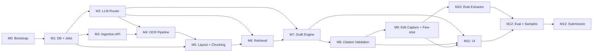

# Milestone Roadmap

This is the build plan. Each milestone is a separate spec doc in this folder that you feed to Claude Code as the unit of work.

## How to use a milestone with Claude Code

For each milestone, paste this into Claude Code:

```
Context files to read first (in this order):
  1. docs/architecture/00-summary.md
  2. docs/architecture/10-fixes-and-non-negotiables.md     ← always
  3. docs/architecture/project-skeleton.md
  4. docs/architecture/02-architecture.md
  5. <component docs listed in this milestone>
  6. <previous milestone(s) listed as dependencies>

Then read this milestone spec and produce:
  a) PLAN.md  — your implementation plan, the files you'll touch,
                acceptance check, risk notes. Do not write code yet.
  b) After I approve PLAN.md, implement everything in the spec.
  c) Tests in tests/ as listed in the spec.
  d) Update docs/milestones/M<N>-DONE.md with what shipped, deviations, and follow-ups.

Honor every NN-N rule listed under "Non-Negotiables that apply".
```

You review the `PLAN.md`, approve or push back, then approve the build. Three artifacts per milestone: **spec → plan → implementation + tests**.

## Dependency graph



## Milestone list at a glance

| # | Milestone | NN-N rules wired | Rubric category |
|---|---|---|---|
| **M0** | Bootstrap: repo, deps, FastAPI hello, Docker, logging, errors | NN-12 | Code Quality |
| **M1** | Database + job queue + migrations + pgbouncer | NN-1, NN-3, NN-4, NN-8 | Code Quality |
| **M2** | LLM Router + providers + cache + budget | NN-6, NN-7, NN-12 | Code Quality |
| **M3** | Ingestion API + idempotency + reconciler + SSE | NN-1, NN-2, NN-3, NN-10 | Document Processing |
| **M4** | OCR pipeline: classifier + extractors + VLM with budget | NN-6 | Document Processing |
| **M5** | Layout parsing + semantic chunking + entity extraction + embedding | NN-1, NN-8 | Document Processing |
| **M6** | Retrieval: BM25 + dense + tri-gram + RRF + reranker | NN-4, NN-8 | Retrieval + Grounding |
| **M7** | Draft Engine: templates + extraction + generation | NN-5 | Draft Quality |
| **M8** | Citation Validation: per-claim verifier, unsupported flagging | — | Retrieval + Grounding |
| **M9** | Edit capture + structured diff + few-shot store | NN-5, NN-11 | Improvement from Edits |
| **M10** | Rule Extractor + scheduler + admin endpoint | NN-9 | Improvement from Edits |
| **M11** | UI: upload, draft view with click-cites, edit, admin | NN-10 | Documentation |
| **M12** | Sample documents + eval harness + report | NN-8 | Retrieval + Edits + Docs |
| **M13** | README + architecture pointers + demo script + submission | — | Documentation |

## When to delegate to sub-agents

Claude Code supports sub-agents (parallel work via the Task tool / subagent prompts). Use them where the work is naturally independent:

- **M2 — Providers as sub-agents.** Each `LLMProvider` implementation (`vllm.py`, `anthropic.py`, `openai.py`, `gemini.py`) is independent. Spawn one sub-agent per provider after the base interface and router are merged. Each follows the same pattern, so they parallelize cleanly.
- **M4 — OCR engines as sub-agents.** `pdfplumber_ocr.py`, `paddle_ocr.py`, `vlm_ocr.py`, `preprocess.py` are independent. Same pattern.
- **M11 — UI screens as sub-agents.** Upload page, Document detail, Draft view, Admin can each be built by a sub-agent after the API client (`ui/lib/api.ts`) is shared.
- **M12 — Eval scripts as sub-agents.** `run_retrieval.py`, `run_citation_validity.py`, `run_edit_improvement.py` are independent.

When in doubt, **don't** spawn sub-agents. Sequential debugging is faster than parallel debugging when you're learning the codebase.

## What to do if you fall behind

**Cut, in this order:**

1. **First cut: M11 → Streamlit.** A 200-line Streamlit app does the demo. Lose visual polish, keep functionality.
2. **Second cut: M10 rule-extractor sophistication.** Stage 1 (few-shot retrieval, which is M9) is the minimum credible improvement loop. M10 stage-2 (LLM-extracted rules) is the second half. Ship stage 1 well; ship stage 2 with a working endpoint but a simple clustering rule.
3. **Third cut: M4 VLM fallback.** Ship without VLM escalation. PaddleOCR handles 90% of realistic samples. Document the gap; the per-document budget cap (NN-6) still applies to make the architecture coherent.
4. **Never cut: M1's job queue, M3's idempotency, M5's reconciliation gate, M8's citation validator, M9's structured diff.** These are what the rubric is actually testing.

